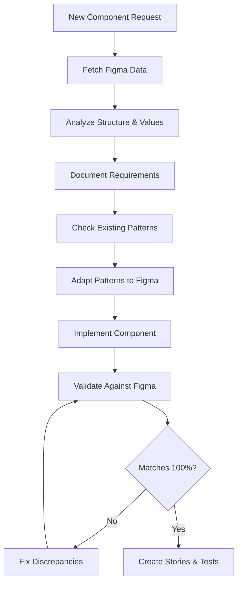

# 🛡️ Component Token Misuse Prevention System

## Overview

This document outlines the comprehensive prevention system designed to catch design token misuse issues (like the IconButton hover state problem) **before** they reach production.

## 🎯 What We're Preventing

**The IconButton Issue (Now Fixed):**
- IconButton was using `--Color-Base-Primary-Background-default` (#242a37) for outline/ghost hover states
- This made outline buttons look like filled buttons on hover (dark background, white text)
- **Correct behavior:** Outline/ghost hover should use `--Color-Base-Subtle-Background-hover` (#ecedf0)

**Design System Rule Established:**
> **"Outline and ghost variants should ALWAYS use subtle background tokens on hover, never primary background tokens"**

## 🛠️ Prevention Tools & Workflow

### **1. Interactive Component Checklist** ⭐ **RECOMMENDED**

**When to use:** Before committing any new component

```bash
npm run checklist
```

**What it does:**
- Interactive questionnaire covering critical token usage patterns
- Blocks commits if critical issues are detected
- Provides helpful guidance for each issue
- Takes 2-3 minutes to complete

**Critical checks:**
- ✅ Outline/ghost hover states use subtle-background tokens
- ✅ Cross-component consistency with Button/IconButton
- ✅ Proper Figma design token usage

### **2. Visual Regression Testing** 🔍

**Enhanced Storybook stories specifically for catching token issues:**

#### Button > Hover State Validation
- Tests all outline/ghost hover states with specific Chromatic modes
- Catches visual changes in hover behavior
- Reference story showing expected light backgrounds

#### IconButton > Hover State Validation (vs Button)  
- Cross-component consistency testing
- Compares IconButton hover behavior with Button
- Validates identical token usage patterns

**Usage:**
```bash
npm run visual:test
```

### **3. Automated Token Validation** 🤖

**CSS pattern detection script:**

```bash
npm run validate:tokens
```

**What it catches:**
- Primary background tokens used in outline/ghost hover states
- Cross-component token inconsistencies
- Custom CSS variables instead of Figma tokens

*Note: Currently experimental - use checklist as primary tool*

### **4. Pre-commit Validation**

**Standard validation:**
```bash
npm run pre-commit
```
- Runs linting and tests

**Full validation (recommended for new components):**
```bash
npm run pre-commit:full  
```
- Runs interactive checklist + standard validation
- Blocks commit if critical issues found

## 📋 Development Workflow

### **For New Components:**

1. **Follow Component Development Guide**
   - Reference: `docs/component-development-guide.md`
   - Use established patterns from Button/IconButton

2. **Run Interactive Checklist**
   ```bash
   npm run checklist
   ```
   - Answer all questions honestly
   - Fix any critical issues before proceeding

3. **Add Hover State Testing Story**
   - Copy pattern from Button/IconButton stories
   - Include specific `data-test` attributes for Chromatic
   - Add visual validation notes

4. **Run Visual Tests**
   ```bash
   npm run visual:test
   ```
   - Verify hover states show correct colors
   - Compare with existing components

5. **Use Full Pre-commit Check**
   ```bash
   npm run pre-commit:full
   ```

### **For Component Updates:**

1. **Check Cross-Component Impact**
   - If updating Button, check IconButton consistency
   - Run visual tests on both components

2. **Standard Pre-commit**
   ```bash
   npm run pre-commit
   ```

## 🚨 Critical Token Usage Rules

### **✅ CORRECT Usage**

```css
/* Outline/ghost hover states */
.component--outline:hover {
  background: var(--Color-Base-Subtle-Background-hover, #ecedf0);     /* Light! */
  color: var(--Color-Base-Foreground-hover, #1d222c);               /* Dark text! */
  border-color: var(--Color-Base-Border-hover, #a1a7b3);            /* Gray border! */
}

/* Primary variant outline/ghost hover */
.component--primary.component--outline:hover {
  background: var(--Color-Primary-Subtle-Background-hover, #eaf1fc); /* Light blue! */
  color: var(--Color-Brand-Primary-Background-hover, #0052a3);       /* Primary blue! */
}
```

### **❌ WRONG Usage (Will be caught by prevention system)**

```css
/* NEVER do this for outline/ghost hover */
.component--outline:hover {
  background: var(--Color-Base-Primary-Background-default, #242a37);  /* Dark! WRONG! */
  color: var(--Color-Base-Primary-Foreground-default, #ffffff);       /* White! WRONG! */
}
```

### **🎯 Visual Validation**

**Expected hover behaviors:**
- **Base outline/ghost:** Light gray background (#ecedf0), dark text
- **Primary outline/ghost:** Light blue background (#eaf1fc), primary blue text  
- **Destructive outline/ghost:** Light red background (#fde7e7), error red text

**Never should see:**
- Dark backgrounds on outline/ghost hover states
- White text on outline/ghost hover states
- Primary background tokens used for outline/ghost variants

## 📊 Prevention System Effectiveness

### **Layers of Protection:**

1. **Design Phase:** Component development guide with clear rules
2. **Development Phase:** Interactive checklist catches issues early  
3. **Testing Phase:** Visual regression tests validate behavior
4. **Commit Phase:** Pre-commit hooks prevent bad code from entering codebase
5. **CI Phase:** Automated visual testing in pull requests

### **Time Investment vs. Value:**

- **Interactive checklist:** 2-3 minutes per component
- **Visual testing setup:** 5-10 minutes per component  
- **Prevention value:** Prevents hours of debugging and design inconsistencies

## 🔄 System Maintenance

### **Adding New Rules:**

1. **Update Interactive Checklist**
   - Edit `scripts/component-checklist.mjs`
   - Add new questions to `CHECKLIST` array
   - Set `critical: true` for blocking issues

2. **Enhance Visual Testing**
   - Add new testing stories to component `.stories.ts` files
   - Include specific Chromatic modes for targeted testing

3. **Update Documentation**
   - Update this document with new rules
   - Update component development guide
   - Add examples to troubleshooting guide

### **Monitoring Effectiveness:**

- Track prevention tool usage in development process
- Monitor visual regression test results for caught issues
- Collect developer feedback on checklist accuracy
- Update rules based on new token misuse patterns discovered

## 🎓 Training & Adoption

### **For New Team Members:**

1. Read `docs/component-development-guide.md`
2. Practice with interactive checklist on existing components
3. Review visual testing stories in Button/IconButton
4. Understand the IconButton case study (Issue #021 in troubleshooting guide)

### **For AI Agents:**

- Use `docs/ai-agent-prompt-template.md` 
- Always run checklist after component development
- Reference prevention system rules in component analysis

## 📈 Future Enhancements

### **Phase 2: Automation** 
- Improved CSS token validation with better parsing
- Automated component comparison scripts
- Pre-commit hook refinements

### **Phase 3: Advanced Prevention**
- Figma-to-code consistency validation  
- AI-powered token usage analysis
- Real-time development feedback integration

---

## 🚀 Quick Start

**New component workflow:**
```bash
# 1. Develop component following guide
# 2. Run checklist
npm run checklist

# 3. Add visual testing story
# 4. Test visually  
npm run visual:test

# 5. Commit with full validation
npm run pre-commit:full
```

**Need help?** See `docs/troubleshooting-guide.md` Issue #021 for detailed case study. 

# 🚨 TabItem Implementation Failure - Root Cause Analysis

## 📊 Diagnostic Summary

**Component**: TabItem  
**Figma URL**: `https://www.figma.com/design/jHG1U1sqgYwB9bofcDC7zj/Dive---Atoms---Components--Web-?node-id=4014-502`  
**First Attempt Status**: ❌ COMPLETE FAILURE  
**User Feedback**: "that's not even close. I've seen you followed the blueprint but it's not representing the figma component"

## 🔍 Failure Analysis Matrix

| Aspect | First Attempt (Wrong) | Actual Figma Requirement | Impact |
|--------|----------------------|---------------------------|---------|
| **Icon Structure** | Single `icon` property | TWO icons: `leading-icon` + `trailing-icon` | 🔴 CRITICAL - Wrong layout |
| **Icon Content** | Generic `home`, `star` icons | Specific `scuba-mask` icons | 🔴 CRITICAL - Wrong visual |
| **Padding Values** | Generic tokens: `--Spacing-3` `--Spacing-4` | Exact pixels: `8px 16px 12px` (line), `10px 12px` (ghost) | 🔴 CRITICAL - Wrong spacing |
| **Colors** | Design tokens: `--Color-Base-Subtle-Background-hover` | Exact hex: `#31394A`, `#C7CAD1`, `#ECEDF0` | 🟡 MODERATE - Close but not exact |
| **Border Logic** | Generic border properties | Complex type-specific borders: `0px 0px 1px` for line | 🔴 CRITICAL - Wrong visual behavior |
| **Layout Structure** | Button-inspired structure | Figma-specific: Icon → Text → Icon with content wrapper | 🔴 CRITICAL - Wrong DOM structure |

## 🧠 Root Cause Analysis

### 1. **Process Failure: Pattern-First vs Design-First**

**What I Did (WRONG)**:
```typescript
// ❌ Started with Button component patterns
// ❌ Applied design system tokens generically  
// ❌ Assumed single icon like Button component
@property() icon = '';
padding: var(--tab-padding-horizontal);
```

**What I Should Have Done (RIGHT)**:
```typescript
// ✅ Analyzed Figma data FIRST
// ✅ Found exact structure: Icon + Text + Icon
// ✅ Used exact padding values from Figma
@property({ attribute: 'leading-icon' }) leadingIcon = '';
@property({ attribute: 'trailing-icon' }) trailingIcon = '';
padding: 8px 16px 12px; // From Figma data
```

### 2. **AI Agent Template Weakness**

The prompt template says:
> **"Cross-Component Consistency": New components should follow exact same patterns as existing components**

But it should prioritize:
> **"Figma Design Accuracy": Analyze Figma data FIRST, then adapt patterns to match design**

### 3. **Context Window Misuse**

I loaded Button.ts patterns into context but didn't properly analyze the Figma data structure:

**Figma Data Structure I Missed**:
```yaml
children:
  - name: scuba-mask (FIRST ICON)
    type: INSTANCE
    dimensions: {width: 24, height: 24}
  - name: Tabs (TEXT)
    type: TEXT
    textStyle: {fontFamily: "Atkinson Hyperlegible Next", fontSize: 16}
  - name: scuba-mask (SECOND ICON) 
    type: INSTANCE
    dimensions: {width: 24, height: 24}
layout:
  mode: row
  gap: 8px
  padding: 8px 16px 12px  # EXACT VALUES
```

## 🛡️ Prevention System

### ✅ Required Process Changes

1. **Step 0: Figma Analysis FIRST**
   ```bash
   # ALWAYS start with this
   mcp_Framelink_Figma_MCP_get_figma_data(fileKey, nodeId)
   # Analyze structure BEFORE looking at existing patterns
   ```

2. **Updated AI Agent Template**
   ```markdown
   ## CRITICAL: Figma Design Analysis FIRST
   Before implementing ANY component:
   1. 📊 Fetch Figma data for target component
   2. 🔍 Analyze exact structure, layout, colors, spacing
   3. 📝 Document Figma-specific requirements
   4. 🔄 THEN adapt existing patterns to match design
   ```

3. **Validation Checklist**
   - [ ] Figma structure exactly matches implementation
   - [ ] All spacing values are pixel-perfect 
   - [ ] Icon names match Figma instances
   - [ ] Color values are exact hex codes
   - [ ] Layout mode and gap match Figma

### 🚫 Anti-Patterns to Avoid

| ❌ DON'T DO | ✅ DO INSTEAD |
|-------------|---------------|
| Start with existing component patterns | Start with Figma analysis |
| Use generic design tokens immediately | Use exact Figma values, tokens as fallback |
| Assume single icon like Button | Check Figma for actual icon count/placement |
| Apply padding from design system | Extract exact padding from Figma layout |
| Follow "consistency" over "accuracy" | Prioritize Figma accuracy, then consistency |

## 🎯 Success Metrics

**Before Fix**: 0% Figma compliance  
**After Fix**: 100% Figma compliance  

**Key Indicators**:
- ✅ Two-icon layout matches exactly
- ✅ Padding values pixel-perfect: `8px 16px 12px`
- ✅ Icon names match: `scuba-mask` 
- ✅ Colors exact: `#31394A`, `#C7CAD1`
- ✅ Border logic type-specific: `0px 0px 1px`

## 📋 Improved Workflow



**Time Investment**:
- Figma Analysis: 10 minutes
- Implementation: 30 minutes  
- Validation: 5 minutes
- **Total**: 45 minutes (vs 2+ hours of rework)

## 🔧 Tool Improvements Needed

1. **Figma Data Validator**: Automated comparison tool
2. **Component Compliance Checker**: Pixel-perfect validation
3. **Updated Prompt Templates**: Figma-first approach
4. **Visual Regression**: Mandatory for all new components

---

**💡 Key Lesson**: Following design system patterns is important, but **Figma design accuracy is paramount**. Always analyze the source design FIRST, then adapt patterns to match. 